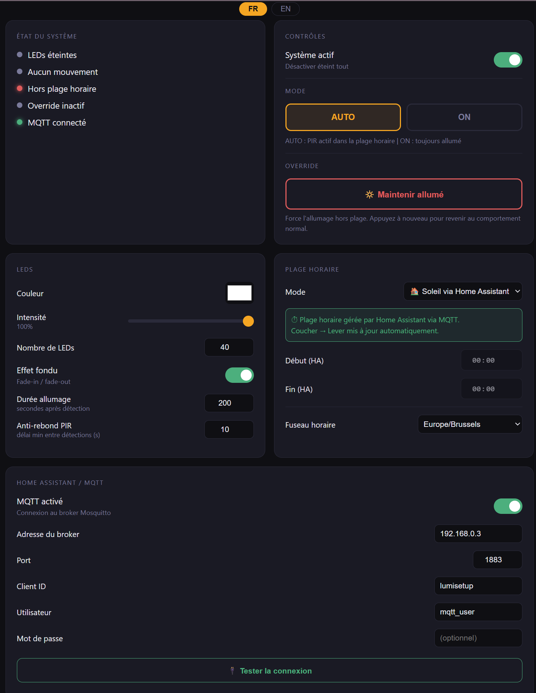

# 💡 LumiSetup — ESP32

<p align="center">
  
</p>

<p align="center">
  <a href="#français">🇫🇷 Français</a> &nbsp;·&nbsp;
  <a href="#english">🇬🇧 English</a>
</p>

<p align="center">
  <a href="https://egamaker.be" target="_blank">
    
  </a>
  
  
  
</p>

---

## Français

### 📖 Description

LumiSetup est une lampe connectée DIY basée sur un **ESP32 WROOM-32**. Elle s'allume automatiquement à la détection de mouvement (capteur PIR HC-SR501), uniquement dans une plage horaire configurable. Tout se contrôle depuis une **interface web embarquée** accessible depuis n'importe quel appareil sur votre réseau.

**Fonctionnalités principales :**
- Détection de mouvement PIR avec anti-rebond configurable
- Plage horaire en 3 modes : Manuel / Soleil via Home Assistant / Soleil automatique par ville
- Fuseau horaire avec gestion automatique heure été/hiver (33 zones disponibles)
- Interface web bilingue FR/EN optimisée mobile
- Intégration Home Assistant via MQTT (AsyncMqttClient)
- Contrôle couleur RGB et intensité depuis l'interface et depuis HA
- Effet fondu (fade-in / fade-out) configurable
- Mode ON forcé, Override manuel
- Portail WiFi captif au premier démarrage
- Icône application pour écran d'accueil téléphone (Web App Manifest)

---

### 🛒 Matériel nécessaire

| Composant | Détails | Lien |
|-----------|---------|------|
| ESP32 WROOM-32 | TYPE-C CH340C/CP2102 | [AliExpress](https://s.click.aliexpress.com/e/_c4dUVEEv) |
| Capteur PIR | HC-SR501 (recommandé) | [AliExpress](https://s.click.aliexpress.com/e/_c3IHPyYx) |
| Ruban LED | WS2812B (30 LEDs/m) | [AliExpress](https://s.click.aliexpress.com/e/_c4LMDEiT) |
| Alimentation | 5V / 2A minimum | [AliExpress](https://s.click.aliexpress.com/e/_c3k73Qgn) |
| Connecteur DC | Jack femelle 5.5mm x 2.1mm | [AliExpress](https://s.click.aliexpress.com/e/_c42pIl07) |

> ⚠️ **HC-SR501 recommandé** plutôt que le SR505 — le SR505 a un temps de blocage interne fixe (~8 secondes) sans réglage possible. Le HC-SR501 dispose de deux potentiomètres pour ajuster la sensibilité et le délai.

---

### 🔌 Câblage

```
HC-SR501  →  VCC : 3.3V  |  GND : GND  |  OUT : GPIO14
WS2812B   →  DIN : GPIO12 |  5V  : Alimentation externe
Alim 5V   →  +   : VIN ESP32 + 5V LEDs  |  − : GND commun
```

> ⚠️ Le **GND doit être commun** entre l'alimentation, l'ESP32 et les LEDs.

> 🔴 Le ruban WS2812B a un **sens de branchement** — connectez toujours sur l'extrémité **DIN** (indiquée par une flèche sur le ruban).

---

### 📦 Installation des librairies

> ⚠️ **NE PAS installer WiFiManager** — conflit avec ESPAsyncWebServer. Le portail WiFi est géré directement dans le code.

#### Via le gestionnaire de bibliothèques Arduino IDE

| Librairie | Auteur |
|-----------|--------|
| FastLED | Daniel Garcia |
| ArduinoJson v6 | Benoit Blanchon |

#### ⚠️ Via ZIP GitHub uniquement — PAS dans le gestionnaire

Ces librairies ne sont **pas disponibles dans le gestionnaire Arduino** et doivent être installées manuellement via ZIP. Procédure : **Croquis → Inclure une bibliothèque → Ajouter la bibliothèque .ZIP**

Installer **dans cet ordre** :

**1. AsyncTCP** — fork Mathieu Carbou (obligatoire pour ESP32 core v3.x)
```
https://github.com/mathieucarbou/AsyncTCP/archive/refs/heads/main.zip
```

> ⚠️ Ne pas utiliser le repo original `me-no-dev/AsyncTCP` — incompatible avec ESP32 core v3.x

**2. ESPAsyncWebServer** — fork Mathieu Carbou (obligatoire pour ESP32 core v3.x)
```
https://github.com/mathieucarbou/ESPAsyncWebServer/archive/refs/heads/main.zip
```

> ⚠️ Ne pas utiliser le repo original `me-no-dev/ESPAsyncWebServer` — l'API mbedtls a changé dans ESP32 core v3.x et cause des erreurs de compilation avec l'original

**3. async-mqtt-client** — Marvin Roger
```
https://github.com/marvinroger/async-mqtt-client/archive/refs/heads/master.zip
```

> ℹ️ AsyncMqttClient est spécialement conçu pour fonctionner avec ESPAsyncWebServer sans conflit — contrairement à PubSubClient qui est instable sur ESP32 avec un serveur web asynchrone.

---

### ⚙️ Configuration Arduino IDE

| Paramètre | Valeur |
|-----------|--------|
| Package ESP32 | `https://raw.githubusercontent.com/espressif/arduino-esp32/gh-pages/package_esp32_index.json` |
| Carte | ESP32 Dev Module |
| Partition Scheme | **Huge APP (3MB No OTA/1MB SPIFFS)** |
| Flash Size | 4MB |

> ⚠️ Le schéma de partition **Huge APP** est obligatoire — le sketch dépasse la taille par défaut de 1.2MB.

---

### 🚀 Premier démarrage

1. Uploadez le code sur votre ESP32
2. Connectez-vous au WiFi **LumiSetup** (mot de passe : `lumi1234`)
3. Une page de configuration s'ouvre automatiquement — ou tapez `192.168.4.1`
4. Choisissez votre langue (FR/EN), entrez vos identifiants WiFi et validez
5. L'ESP32 redémarre et rejoint votre réseau

Une fois connecté, accédez à l'interface via `http://lumisetup.local` depuis n'importe quel appareil sur votre réseau.

---

### 🌐 Interface web

L'interface est disponible en **français ou anglais** et optimisée pour mobile. Elle permet de contrôler :

- **Mode AUTO** — le PIR s'active uniquement dans la plage horaire
- **Mode ON** — les LEDs restent allumées en permanence
- **Override** — force l'allumage à tout moment
- **Couleur & intensité** — contrôle RGB complet
- **Plage horaire** — 3 modes disponibles :
  - **Manuel** — vous définissez start/end
  - **Soleil via HA** — Home Assistant envoie les heures via MQTT
  - **Soleil automatique** — l'ESP32 interroge l'API par nom de ville, mise à jour quotidienne
- **Fuseau horaire** — 33 zones avec gestion heure été/hiver automatique
- **MQTT** — configuration complète du broker depuis l'interface

---

### 🏠 Intégration Home Assistant

#### Topics MQTT

| State topic | Valeurs | Description |
|-------------|---------|-------------|
| `lumisetup/state/leds` | `on/off` | État des LEDs |
| `lumisetup/state/pir` | `on/off` | Détection mouvement |
| `lumisetup/state/system` | `on/off` | Système actif |
| `lumisetup/state/override` | `on/off` | Override actif |
| `lumisetup/state/mode` | `on/auto` | Mode actuel |
| `lumisetup/state/brightness` | `0-100` | Intensité |
| `lumisetup/state/color` | `#rrggbb` | Couleur |

| Command topic | Valeurs | Action |
|---------------|---------|--------|
| `lumisetup/cmd/system` | `on/off` | Active/désactive le système |
| `lumisetup/cmd/override` | `on/off` | Active/désactive l'override |
| `lumisetup/cmd/mode` | `on/auto` | Change le mode |
| `lumisetup/cmd/brightness` | `0-100` | Change l'intensité |
| `lumisetup/cmd/color` | `#rrggbb` | Change la couleur |
| `lumisetup/cmd/schedule` | `{"start":"HH:MM","end":"HH:MM"}` | Met à jour la plage horaire |

> ℹ️ Tous les topics `state` sont publiés avec `retain: true` — Home Assistant récupère l'état immédiatement au démarrage.

#### Configuration YAML

```yaml
mqtt:
  light:
    - name: "LumiSetup"
      unique_id: lumisetup_light
      state_topic: "lumisetup/state/leds"
      command_topic: "lumisetup/cmd/override"
      payload_on: "on"
      payload_off: "off"
      brightness_state_topic: "lumisetup/state/brightness"
      brightness_command_topic: "lumisetup/cmd/brightness"
      brightness_scale: 100
      rgb_state_topic: "lumisetup/state/color"
      rgb_command_topic: "lumisetup/cmd/color"
      rgb_value_template: >
        
        {{ c[0:2]|int(0,16) }},{{ c[2:4]|int(0,16) }},{{ c[4:6]|int(0,16) }}
      rgb_command_template: "{{ '#%02x%02x%02x' % (red, green, blue) }}"
      retain: true
      optimistic: false

  binary_sensor:
    - name: "LumiSetup PIR"
      unique_id: lumisetup_pir
      state_topic: "lumisetup/state/pir"
      payload_on: "on"
      payload_off: "off"
      device_class: motion

  switch:
    - name: "LumiSetup Système"
      unique_id: lumisetup_system
      state_topic: "lumisetup/state/system"
      command_topic: "lumisetup/cmd/system"
      payload_on: "on"
      payload_off: "off"
      retain: true

    - name: "LumiSetup Mode ON"
      unique_id: lumisetup_mode
      state_topic: "lumisetup/state/mode"
      command_topic: "lumisetup/cmd/mode"
      payload_on: "on"
      payload_off: "auto"
      state_on: "on"
      state_off: "auto"
      retain: true
```

#### Automatisation lever/coucher du soleil

```yaml
automation:
  - alias: "LumiSetup — Plage horaire soleil"
    trigger:
      - platform: sun
        event: sunset
      - platform: sun
        event: sunrise
    action:
      - action: mqtt.publish
        data:
          topic: "lumisetup/cmd/schedule"
          payload: >-
            {"start":"{{ as_timestamp(states.sun.sun.attributes.next_setting) | timestamp_custom('%H:%M', true) }}","end":"{{ as_timestamp(states.sun.sun.attributes.next_rising) | timestamp_custom('%H:%M', true) }}"}
```

---

### 📁 Structure du projet

```
lumisetup-esp32/
├── lumisetup/
│   ├── lumisetup.ino      ← Code principal
│   ├── portal_html.h      ← Page portail WiFi
│   └── index_html.h       ← Interface web principale
├── images/
│   └── wiring.svg         ← Schéma de câblage
└── README.md
```

---

### 📄 Licence

MIT — Egalistel / [egamaker.be](https://egamaker.be)

<p align="center">
  <a href="https://buymeacoffee.com/egalistelw" target="_blank">
    
  </a>
</p>

---

## English

### 📖 Description

LumiSetup is a DIY smart lamp based on an **ESP32 WROOM-32**. It turns on automatically when motion is detected (PIR sensor HC-SR501), but only within a configurable time range. Everything is controlled through a **built-in web interface** accessible from any device on your network.

**Main features:**
- PIR motion detection with configurable debounce
- Time range in 3 modes: Manual / Sunrise via Home Assistant / Automatic sunrise by city
- Timezone with automatic summer/winter time (33 zones available)
- Bilingual FR/EN web interface optimized for mobile
- Home Assistant integration via MQTT (AsyncMqttClient)
- RGB color and brightness control from interface and HA
- Configurable fade effect (fade-in / fade-out)
- Forced ON mode, manual Override
- Captive WiFi portal on first boot
- App icon for phone home screen (Web App Manifest)

---

### 🛒 Hardware

| Component | Details | Link |
|-----------|---------|------|
| ESP32 WROOM-32 | TYPE-C CH340C/CP2102 | [AliExpress](https://s.click.aliexpress.com/e/_c4dUVEEv) |
| PIR Sensor | HC-SR501 (recommended) | [AliExpress](https://s.click.aliexpress.com/e/_c3IHPyYx) |
| LED Strip | WS2812B (30 LEDs/m) | [AliExpress](https://s.click.aliexpress.com/e/_c4LMDEiT) |
| Power Supply | 5V / 2A minimum | [AliExpress](https://s.click.aliexpress.com/e/_c3k73Qgn) |
| DC Connector | Female jack 5.5mm x 2.1mm | [AliExpress](https://s.click.aliexpress.com/e/_c42pIl07) |

> ⚠️ **HC-SR501 recommended** over the SR505 — the SR505 has a fixed internal blocking time (~8 seconds) with no adjustment. The HC-SR501 has two potentiometers to adjust sensitivity and delay.

---

### 🔌 Wiring

```
HC-SR501  →  VCC: 3.3V  |  GND: GND  |  OUT: GPIO14
WS2812B   →  DIN: GPIO12 |  5V: External power supply
Power 5V  →  +: VIN ESP32 + 5V LEDs  |  −: Common GND
```

> ⚠️ **GND must be common** between the power supply, ESP32 and LEDs.

> 🔴 The WS2812B strip has a **connection direction** — always connect on the **DIN** end (indicated by an arrow on the strip).

---

### 📦 Library Installation

> ⚠️ **DO NOT install WiFiManager** — conflicts with ESPAsyncWebServer. The WiFi portal is handled directly in the code.

#### Via Arduino IDE Library Manager

| Library | Author |
|---------|--------|
| FastLED | Daniel Garcia |
| ArduinoJson v6 | Benoit Blanchon |

#### ⚠️ Via GitHub ZIP only — NOT in the library manager

These libraries are **not available in the Arduino library manager** and must be installed manually via ZIP. Procedure: **Sketch → Include Library → Add .ZIP Library**

Install **in this order**:

**1. AsyncTCP** — Mathieu Carbou fork (required for ESP32 core v3.x)
```
https://github.com/mathieucarbou/AsyncTCP/archive/refs/heads/main.zip
```

> ⚠️ Do not use the original `me-no-dev/AsyncTCP` repo — incompatible with ESP32 core v3.x

**2. ESPAsyncWebServer** — Mathieu Carbou fork (required for ESP32 core v3.x)
```
https://github.com/mathieucarbou/ESPAsyncWebServer/archive/refs/heads/main.zip
```

> ⚠️ Do not use the original `me-no-dev/ESPAsyncWebServer` repo — the mbedtls API changed in ESP32 core v3.x causing compilation errors with the original

**3. async-mqtt-client** — Marvin Roger
```
https://github.com/marvinroger/async-mqtt-client/archive/refs/heads/master.zip
```

> ℹ️ AsyncMqttClient is specifically designed to work with ESPAsyncWebServer without conflicts — unlike PubSubClient which is unstable on ESP32 with an async web server.

---

### ⚙️ Arduino IDE Settings

| Setting | Value |
|---------|-------|
| ESP32 Package | `https://raw.githubusercontent.com/espressif/arduino-esp32/gh-pages/package_esp32_index.json` |
| Board | ESP32 Dev Module |
| Partition Scheme | **Huge APP (3MB No OTA/1MB SPIFFS)** |
| Flash Size | 4MB |

> ⚠️ The **Huge APP** partition scheme is mandatory — the sketch exceeds the default 1.2MB limit.

---

### 🚀 First Boot

1. Upload the code to your ESP32
2. Connect to the **LumiSetup** WiFi (password: `lumi1234`)
3. A configuration page opens automatically — or type `192.168.4.1`
4. Choose your language (FR/EN), enter your WiFi credentials and confirm
5. The ESP32 restarts and joins your network

Once connected, access the interface at `http://lumisetup.local` from any device on your network.

---

### 📁 Project Structure

```
lumisetup-esp32/
├── lumisetup/
│   ├── lumisetup.ino      ← Main code
│   ├── portal_html.h      ← WiFi portal page
│   └── index_html.h       ← Main web interface
├── images/
│   └── wiring.svg         ← Wiring diagram
└── README.md
```

---

### 📄 License

MIT — Egalistel / [egamaker.be](https://egamaker.be)

<p align="center">
  <a href="https://buymeacoffee.com/egalistelw" target="_blank">
    
  </a>
</p>
